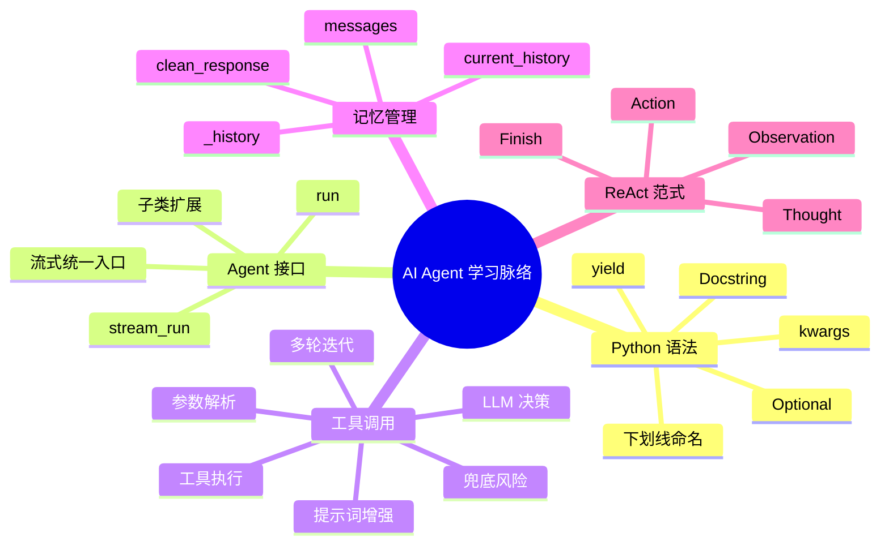
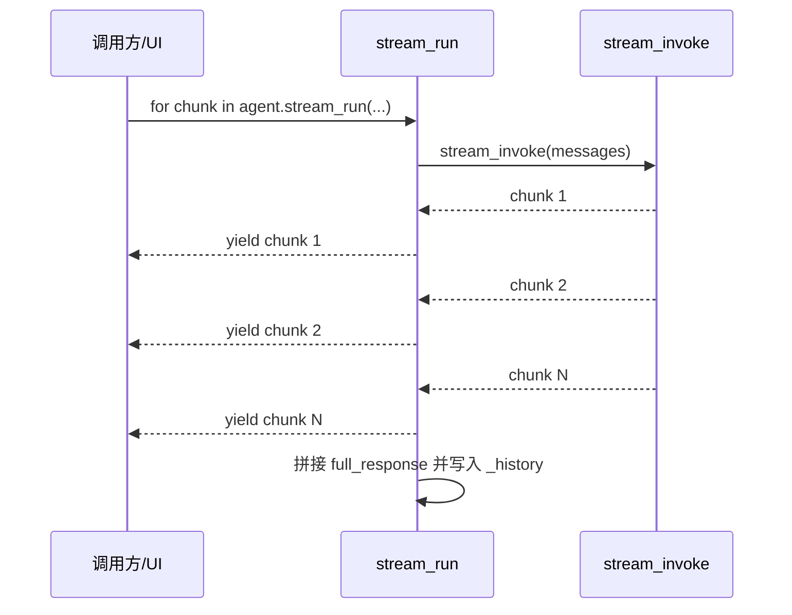
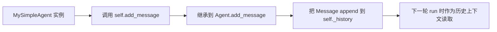
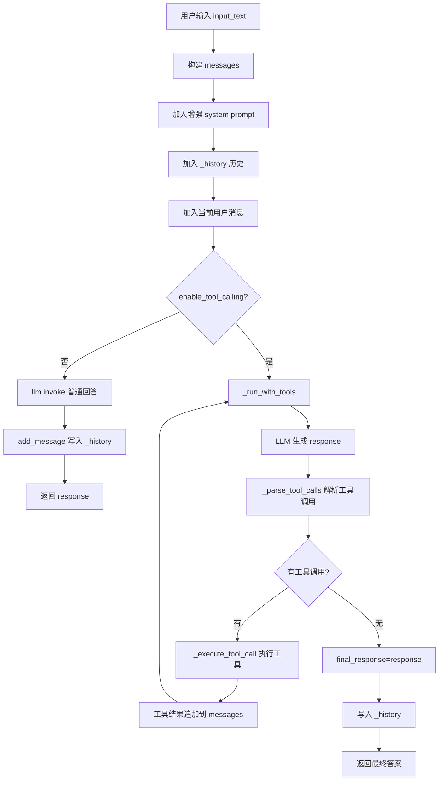
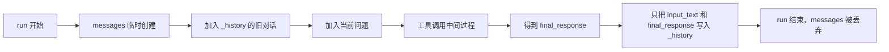
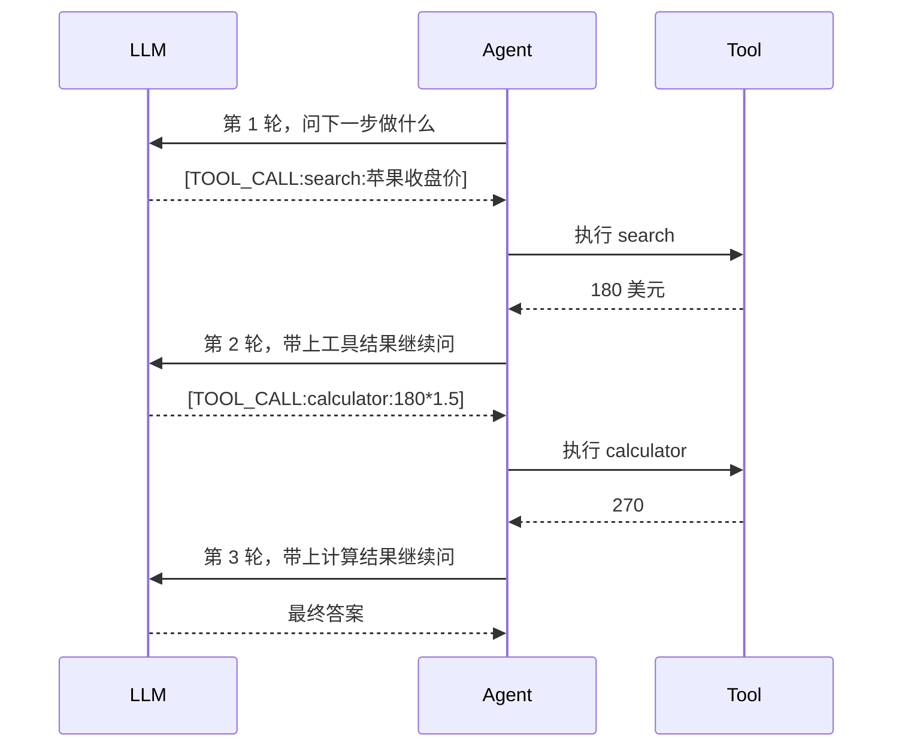
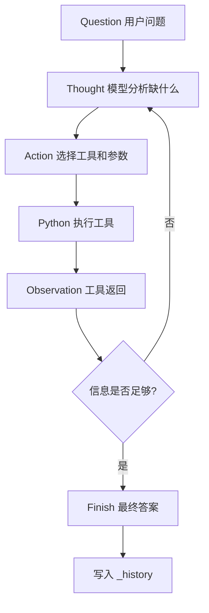
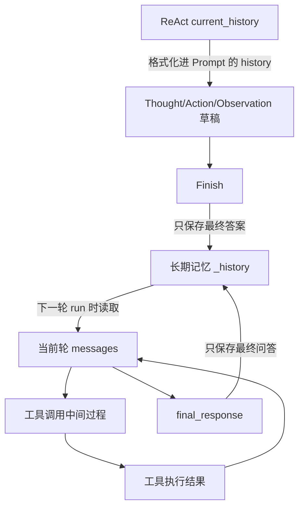

# AI Agent 架构与 Python 工程实践探讨记录

本文档按你的提问路线，系统总结了我们围绕 `MySimpleAgent`、`MyReActAgent`、`Agent` 基类、`ToolRegistry` 展开的讨论。重点不是简单罗列结论，而是把每个问题背后的对比关系、执行流程、记忆边界和架构取舍串起来。

## 阅读地图



## 源码索引

| 文件 | 关注点 | 关键代码 |
|---|---|---|
| [`my_simple_agent.py`](file:///Users/bytedance/Documents/self/code/hands-on_ai_agents/hello_agents/agents/my_simple_agent.py) | 自定义简单 Agent、工具调用、流式输出 | `run`、`_run_with_tools`、`_execute_tool_call`、`stream_run` |
| [`my_react_agent.py`](file:///Users/bytedance/Documents/self/code/hands-on_ai_agents/hello_agents/agents/my_react_agent.py) | ReAct 推理-行动循环 | `Thought`、`Action`、`Observation`、`current_history` |
| [`agent.py`](file:///Users/bytedance/miniconda3/lib/python3.12/site-packages/hello_agents/core/agent.py) | Agent 抽象基类 | `run` 抽象方法、`_history`、`add_message` |
| [`registry.py`](file:///Users/bytedance/miniconda3/lib/python3.12/site-packages/hello_agents/tools/registry.py) | 工具注册与执行 | `register_tool`、`execute_tool`、`get_tool` |

## 1. Python 语法问题总结

### 1.1 `Optional['ToolRegistry']` 是什么

位置：[`my_simple_agent.py`](file:///Users/bytedance/Documents/self/code/hands-on_ai_agents/hello_agents/agents/my_simple_agent.py)

```python
tool_registry: Optional['ToolRegistry'] = None
```

它表达的是：`tool_registry` 可以是一个 `ToolRegistry` 实例，也可以是 `None`。

这里有两个点：

| 写法 | 含义 |
|---|---|
| `Optional[T]` | 等价于 `Union[T, None]`，表示参数可为空 |
| `'ToolRegistry'` | 字符串形式的类型提示，叫前向引用，避免类尚未加载或循环导入时出错 |

在 Agent 设计中，这体现了依赖注入：外部可以给 Agent 注入工具注册表；如果不注入，它就是一个纯对话 Agent。

### 1.2 `**kwargs` 是什么

位置：[`my_simple_agent.py`](file:///Users/bytedance/Documents/self/code/hands-on_ai_agents/hello_agents/agents/my_simple_agent.py)

```python
def run(self, input_text: str, max_tool_iterations: int = 3, **kwargs) -> str:
```

`**kwargs` 会把额外的关键字参数收集成一个字典。

例如：

```python
agent.run(
    "帮我查天气",
    temperature=0.2,
    timeout=30,
    session_id="s-001",
)
```

内部就可以拿到：

```python
kwargs = {
    "temperature": 0.2,
    "timeout": 30,
    "session_id": "s-001",
}
```

在 Agent 框架里，它常用于把 LLM 参数、链路上下文、运行时配置继续传给底层：

```python
response = self.llm.invoke(messages, **kwargs)
```

### 1.3 Go 语言有没有 `**kwargs`

Go 没有 Python 这种动态关键字参数。常见替代方案如下：

| 方案 | 类似能力 | 优点 | 风险 |
|---|---|---|---|
| Functional Options | 可选参数、默认值 | 类型安全、扩展性好 | 模板代码多 |
| `map[string]any` | 最接近 `kwargs` | 非常灵活 | 运行时类型断言，容易丢失类型安全 |
| `context.Context` | 透传请求级元信息 | Go 生态标准 | 不适合承载核心业务参数 |

推荐组合：

```text
Agent 配置参数 -> Functional Options
链路追踪/请求元数据 -> context.Context
完全动态参数 -> map[string]any，谨慎使用
```

### 1.4 `_history` 为什么前面加 `_`

位置：[`agent.py`](file:///Users/bytedance/miniconda3/lib/python3.12/site-packages/hello_agents/core/agent.py)

```python
self._history: list[Message] = []
```

单下划线是 Python 约定：这是内部属性，不建议外部直接访问或修改。

它不是语法层面的强制私有，外部仍然能写：

```python
agent._history.append(...)
```

但工程上推荐通过公共方法维护：

```python
agent.add_message(...)
agent.get_history()
agent.clear_history()
```

这样以后 `_history` 从内存列表换成 Redis、SQLite 或向量库时，外部调用代码不需要跟着改。

### 1.5 `"""..."""` 算注释吗

位置：[`my_simple_agent.py`](file:///Users/bytedance/Documents/self/code/hands-on_ai_agents/hello_agents/agents/my_simple_agent.py)

```python
"""支持工具调用的运行逻辑"""
```

它叫 Docstring，文档字符串。它和 `# 注释` 的区别如下：

| 类型 | 是否进入运行时 | 用途 |
|---|---|---|
| `# 注释` | 不进入 | 只给读源码的人看 |
| `"""Docstring"""` | 会进入对象的 `__doc__` | `help()`、IDE 悬浮提示、自动生成文档 |

Docstring 是 Python 原生的“代码即文档”机制。

### 1.6 `yield chunk` 是什么

位置：[`my_simple_agent.py`](file:///Users/bytedance/Documents/self/code/hands-on_ai_agents/hello_agents/agents/my_simple_agent.py)

```python
for chunk in self.llm.stream_invoke(messages, **kwargs):
    full_response += chunk
    yield chunk
```

`yield` 会把函数变成生成器。它不像 `return` 一次性结束函数，而是：

```text
拿到一个 chunk -> yield 给调用方 -> 暂停
调用方继续要数据 -> 从暂停处继续执行
```

这正是流式输出的基础。LLM 每生成一点文本，Agent 就立刻把这一小段抛给 UI。



## 2. Agent 接口与扩展性

### 2.1 `add_message` 是怎么起作用的

位置：[`agent.py`](file:///Users/bytedance/miniconda3/lib/python3.12/site-packages/hello_agents/core/agent.py)

```python
def add_message(self, message: Message):
    self._history.append(message)
```

`MySimpleAgent` 没有自己定义 `add_message`，但它继承自 `SimpleAgent`，`SimpleAgent` 又继承自 `Agent`，所以能直接调用。

执行逻辑是：



为什么不直接写 `self._history.append(...)`？

因为 `add_message` 是受控入口。未来要加截断、过滤、持久化、审计日志，只改这个方法即可。

### 2.2 Agent 接口只有 `run`，子类实现 `stream_run` 还算 Agent 吗

算。

`Agent` 抽象基类强制子类必须实现的是：

```python
@abstractmethod
def run(self, input_text: str, **kwargs) -> str:
    pass
```

这定义的是最低契约，不是最高限制。子类可以额外实现 `stream_run`、`add_tool`、`list_tools` 等能力。

| 视角 | 能看到什么 |
|---|---|
| `Agent` 抽象视角 | 只保证有 `run` |
| `MySimpleAgent` 具体类型视角 | 还可以用 `stream_run`、`add_tool`、`has_tools` |

### 2.3 只在子类上实现 `stream_run`，扩展性会不会不好

会有这个问题。

如果调用方拿到的是 `Agent` 类型，它只能确定对象有 `run`，不能确定有 `stream_run`。

几种设计方案对比如下：

| 方案 | 接口形态 | 优点 | 缺点 | 适合场景 |
|---|---|---|---|---|
| 基类增加默认 `stream_run` | `Agent.run` + `Agent.stream_run` | 调用方最方便，所有 Agent 都能流式调用 | 不支持真流式的 Agent 只是“假流式” | 框架希望统一调用体验 |
| Mixin/独立接口 | `Agent` + `Streamable` | 能力边界清楚，类似 Go 小接口 | 调用方需要类型判断 | 强调接口隔离 |
| `run(stream=True)` | 一个入口控制流式 | API 简洁，类似 OpenAI SDK | 返回类型变成 `str | Iterator[str]` | 面向用户体验统一 |

你提出“用入参决定是否开启流式”是可行的，类型可以写成：

```python
from typing import Iterator, Union

def run(
    self,
    input_text: str,
    stream: bool = False,
    **kwargs,
) -> Union[str, Iterator[str]]:
    ...
```

或者 Python 3.10+：

```python
def run(...) -> str | Iterator[str]:
    ...
```

调用方需要知道：

```python
result = agent.run("你好")              # str
chunks = agent.run("你好", stream=True) # Iterator[str]
```

### 2.4 `stream_run` 当前是否实现了工具调用

没有。

位置：[`my_simple_agent.py`](file:///Users/bytedance/Documents/self/code/hands-on_ai_agents/hello_agents/agents/my_simple_agent.py)

当前 `stream_run` 做的是：

```text
构建普通 messages -> 调用 llm.stream_invoke -> yield chunk -> 保存完整回答
```

它没有做这些事情：

| 工具调用所需能力 | `run` 有 | `stream_run` 有 |
|---|---:|---:|
| 使用 `_get_enhanced_system_prompt()` 注入工具说明 | 有 | 没有 |
| 解析 `[TOOL_CALL:...]` | 有 | 没有 |
| 执行 `_execute_tool_call` | 有 | 没有 |
| 工具结果回填给 LLM | 有 | 没有 |
| 多轮工具循环 | 有 | 没有 |

原因是：流式工具调用会复杂很多。因为 LLM 返回的是 token 流，可能先吐出 `[`、`TOOL`、`_CALL` 的碎片。代码必须做缓冲和状态机，不能直接把疑似工具指令的内容 `yield` 给用户。

## 3. `MySimpleAgent` 的工具调用机制

### 3.1 总体流程图



### 3.2 不使用工具时，为什么不会被工具提示词污染

你问到：如果 `enable_tool_calling=False`，但是传进去的系统提示词里提示了工具，LLM 会不会返回工具指令？

关键在 `_get_enhanced_system_prompt()` 的防御判断：

```python
if not self.enable_tool_calling or not self.tool_registry:
    return base_prompt
```

所以当工具调用关闭时，系统提示词不会包含工具列表，也不会包含 `[TOOL_CALL:...]` 格式。LLM 不知道工具存在，自然不会正常生成工具调用指令。

### 3.3 为什么 `run` 中普通分支也不用流式

普通分支：

```python
response = self.llm.invoke(messages, **kwargs)
```

原因不是“不能流式”，而是 `run` 的语义就是返回完整字符串：

```python
def run(...) -> str:
```

如果这里改成流式，就会破坏接口契约。更合理的是：

```text
run -> 完整结果
stream_run -> 流式结果
```

或者统一成：

```text
run(stream=False) -> str
run(stream=True) -> Iterator[str]
```

### 3.4 为什么工具调用循环里不用流式

位置：[`my_simple_agent.py`](file:///Users/bytedance/Documents/self/code/hands-on_ai_agents/hello_agents/agents/my_simple_agent.py)

```python
response = self.llm.invoke(messages, **kwargs)
tool_calls = self._parse_tool_calls(response)
```

这里需要一次性拿到完整 response，因为工具调用是靠正则解析完整字符串：

```python
pattern = r'\[TOOL_CALL:([^:]+):([^\]]+)\]'
```

如果用流式，`[TOOL_CALL:search:Python]` 可能被拆成很多 chunk：

```text
[
TOOL
_CALL
:search
:Python
]
```

在没有完整 `]` 之前，代码无法确认这是不是工具指令，也无法安全地 `yield` 给用户。

### 3.5 LLM 返回的是“工具列表”吗

严格说，LLM 返回的不是 Python 列表，而是一段字符串，例如：

```text
我需要先查询天气。
[TOOL_CALL:search:北京天气]
```

随后 `_parse_tool_calls(response)` 把字符串解析成类似这样的列表：

```python
[
    {
        "tool_name": "search",
        "parameters": "北京天气",
        "original": "[TOOL_CALL:search:北京天气]",
    }
]
```

所以流程是：

```text
LLM 文本输出 -> 正则解析 -> Python list[dict] -> 执行工具
```

### 3.6 为什么要 `clean_response`

位置：[`my_simple_agent.py`](file:///Users/bytedance/Documents/self/code/hands-on_ai_agents/hello_agents/agents/my_simple_agent.py)

```python
clean_response = clean_response.replace(call['original'], "")
messages.append({"role": "assistant", "content": clean_response})
```

它的作用是把控制指令 `[TOOL_CALL:...]` 从 assistant 的自然语言内容里移除。

如果不移除，下一轮发给 LLM 的上下文可能变成：

```text
Assistant: 好的，我查一下。[TOOL_CALL:search:北京天气]
User: 工具执行结果: 北京今天晴，25度。请基于这些结果回答。
```

LLM 可能模仿上一轮，继续输出 `[TOOL_CALL:...]`，造成重复调用甚至死循环。

清理后变成：

```text
Assistant: 好的，我查一下。
User: 工具执行结果: 北京今天晴，25度。请基于这些结果回答。
```

这样 LLM 能看到自然语言推理和工具结果，但不会看到旧的控制标签。

### 3.7 `messages` 和 `_history` 的区别

你总结得很对：

```python
messages.append({"role": "user", "content": f"工具执行结果:\n{tool_results_text}\n\n请基于这些结果给出完整的回答。"})
```

这是当前这一轮工具调用过程中的短期上下文。

真正写入长期历史的是：

```python
self.add_message(Message(input_text, "user"))
self.add_message(Message(final_response, "assistant"))
```

对比：

| 名称 | 生命周期 | 内容 | 是否包含工具过程 | 作用 |
|---|---|---|---|---|
| `messages` | 单次 `run` 调用内 | system prompt、旧历史、当前问题、工具结果、中间推理 | 包含 | 给 LLM 当前轮推理使用 |
| `_history` | Agent 实例生命周期内 | 用户问题、最终答案 | 不包含中间工具日志 | 下一轮对话的长期上下文 |

图示：



### 3.8 `_execute_tool_call` 是什么过程

位置：[`my_simple_agent.py`](file:///Users/bytedance/Documents/self/code/hands-on_ai_agents/hello_agents/agents/my_simple_agent.py)

它是 LLM 的文本意图和 Python 工具之间的桥。

例子：用户问“北京天气如何？”

```text
LLM 输出:
[TOOL_CALL:search:北京天气]
```

代码执行：

```python
tool_name = "search"
parameters = "北京天气"
result = self._execute_tool_call(tool_name, parameters)
```

内部过程：

```mermaid
flowchart TD
    A[tool_name + parameters] --> B{是否 calculator?}
    B -- 是 --> C[直接 execute_tool(tool_name, parameters)]
    B -- 否 --> D[_parse_tool_parameters 转成 dict]
    D --> E[get_tool(tool_name)]
    E --> F[tool.run(param_dict)]
    F --> G[返回工具执行结果字符串]
```

### 3.9 为什么需要智能参数解析

你总结为“把 string 改成 JSON，让 Python 底层工具可以直接作为参数调用”，这个理解非常接近。

更准确地说：它是把 LLM 输出的字符串转成 Python 字典。这个字典在语义上类似 JSON object。

例如：

```text
query=Python最新版本,limit=3
```

解析后：

```python
{
    "query": "Python最新版本",
    "limit": "3",
}
```

如果 LLM 只输出裸字符串：

```text
Python最新版本
```

代码会根据工具名推断：

```python
if tool_name == "search":
    param_dict = {"query": parameters}
elif tool_name == "memory":
    param_dict = {"action": "search", "query": parameters}
else:
    param_dict = {"input": parameters}
```

它解决的是这个阻抗不匹配：

```text
LLM 擅长输出文本
Python 工具擅长接收结构化参数
智能参数解析 = 文本 -> dict 的适配器
```

### 3.10 `current_iteration += 1` 和 `continue` 会不会让工具调用多次

会，而且这是故意设计的。

它支持多轮工具调用：



防失控机制是：

```python
while current_iteration < max_tool_iterations:
```

默认最多 3 次工具迭代。

### 3.11 最大迭代次数后的兜底有没有问题

位置：[`my_simple_agent.py`](file:///Users/bytedance/Documents/self/code/hands-on_ai_agents/hello_agents/agents/my_simple_agent.py)

```python
if current_iteration >= max_tool_iterations:
    final_response = self.llm.invoke(messages, **kwargs)
```

这个兜底不是“工具都失败了”的兜底，而是“工具调用次数达到上限”的兜底。

它有一个边界风险：如果最后一次 `llm.invoke` 仍然输出 `[TOOL_CALL:...]`，当前代码不会再解析和清理，可能把工具指令泄漏给用户。

更稳的设计是：

```python
if current_iteration >= max_tool_iterations:
    messages.append({
        "role": "system",
        "content": "请停止调用工具，基于现有工具结果直接给出最终回答。不要输出 [TOOL_CALL:...]。"
    })
    final_response = self.llm.invoke(messages, **kwargs)
    final_response = re.sub(r"\[TOOL_CALL:.*?\]", "", final_response).strip()
```

这个点是你在对代码做架构推理时发现的一个真实 edge case。

## 4. `MySimpleAgent` vs `MyReActAgent`

### 4.1 两种工具调用风格对比

| 维度 | `MySimpleAgent` | `MyReActAgent` |
|---|---|---|
| 工具调用格式 | `[TOOL_CALL:tool:params]` | `Action: tool[input]` |
| 是否显式要求思考 | 不强制 | 强制 `Thought` |
| 工具过程存在哪里 | `messages` 临时上下文 | `current_history` 草稿本 |
| 是否需要 `clean_response` | 需要，避免工具标签污染对话 | 不需要，Action 是显式推理链的一部分 |
| 最终写入 `_history` | 用户问题 + 最终答案 | 用户问题 + `Finish[...]` 中的最终答案 |
| 风格 | 隐式工具调用 | 显式 ReAct 推理 |

### 4.2 `current_history` 是短期记忆吗

位置：[`my_react_agent.py`](file:///Users/bytedance/Documents/self/code/hands-on_ai_agents/hello_agents/agents/my_react_agent.py)

```python
self.current_history = []
```

是。它是当前这次任务的短期工作记忆，也叫 Agent Scratchpad。

每次 `run` 开始都会清空：

```python
def run(self, input_text: str, **kwargs) -> str:
    self.current_history = []
```

所以它不是长期历史。长期历史仍然是：

```python
self.add_message(Message(input_text, "user"))
self.add_message(Message(final_answer, "assistant"))
```

### 4.3 `Thought / Action / Observation` 分别是什么

你总结得非常准：

| 元素 | 含义 | 谁生成 |
|---|---|---|
| `Thought` | 模型的想法、推理过程、为什么要选这个工具 | LLM |
| `Action` | 要执行的具体工具和参数 | LLM |
| `Observation` | 环境或工具的真实返回 | Python 工具 / 外部系统 |
| `Finish` | 模型认为信息足够，输出最终答案 | LLM |

ReAct 循环如下：



### 4.4 这个设计是不是从 LLM 理解角度做的

是的，而且非常典型。

LLM 是无状态的下一个 token 预测模型。ReAct 把“任务执行状态”写成 LLM 很容易理解的文本结构：

```text
Thought: 我需要知道北京天气。
Action: search[北京天气]
Observation: 北京今天晴，25 度。
Thought: 我已经知道天气，可以回答了。
Action: Finish[北京今天晴，25 度。]
```

这种结构有三个好处：

| 设计 | 对 LLM 的帮助 |
|---|---|
| `Thought` | 强制慢思考，让模型先解释原因再行动 |
| `Action` | 把下一步动作格式化，便于代码解析执行 |
| `Observation` | 把环境反馈写回上下文，让模型基于真实信息继续推理 |

这不是单纯给程序看的格式，也是给 LLM 自己看的推理脚手架。

### 4.5 为什么 ReAct 不需要 `clean_response`

`MySimpleAgent` 中 `[TOOL_CALL:...]` 是隐藏的控制标签，所以要清理。

但 `MyReActAgent` 中 `Action` 是 Prompt 明确要求的推理步骤：

```text
Thought: ...
Action: search[北京天气]
Observation: ...
```

这里保留 `Action` 是必要的，因为它告诉 LLM：

```text
我之前为什么得到了这个 Observation？
这个 Observation 是哪个 Action 的结果？
下一步是否还需要继续调用工具？
```

如果删掉 `Action`，上下文会变成：

```text
Thought: 我需要查天气。
Observation: 北京今天晴。
```

逻辑链断了，LLM 反而更难理解。

## 5. 记忆系统的三层对比



| 名称 | 所在 Agent | 类型 | 生命周期 | 是否持久化 | 内容特征 |
|---|---|---|---|---|---|
| `_history` | 基类 `Agent` | 长期对话记忆 | Agent 实例级 | 是 | 干净问答 |
| `messages` | `MySimpleAgent` | 当前轮 LLM 上下文 | 单次 `run` | 否 | 包含工具中间结果 |
| `current_history` | `MyReActAgent` | ReAct 草稿本 | 单次 `run` | 否 | `Action` + `Observation` |
| `full_response` | `stream_run` | 流式结果缓存 | 单次 `stream_run` | 最后写入 | 拼接 chunk 后得到完整回答 |

核心原则：

```text
短期记忆负责把当前任务做完。
长期记忆只保存面向用户的最终对话。
```

## 6. 关键对比矩阵

### 6.1 `run` vs `stream_run`

| 对比项 | `run` | `stream_run` |
|---|---|---|
| 返回类型 | `str` | `Iterator[str]` |
| 用户体验 | 等完整结果 | 边生成边返回 |
| 工具调用 | 当前已支持 | 当前未支持 |
| 保存历史 | 直接保存完整回答 | 先拼 `full_response`，结束后保存 |
| 适合场景 | Agent 间调用、工具调用、多轮推理 | UI 打字机效果、纯聊天 |

### 6.2 `messages` vs `_history`

| 对比项 | `messages` | `_history` |
|---|---|---|
| 变量类型 | 局部变量 | 实例属性 |
| 生命周期 | 一次调用 | Agent 存活期间 |
| 内容粒度 | 细，包含工具过程 | 粗，只存最终问答 |
| 面向对象 | LLM 当前轮推理 | 后续多轮对话 |
| 是否应包含工具日志 | 可以 | 不建议 |

### 6.3 `MySimpleAgent` 隐式工具调用 vs ReAct 显式工具调用

| 对比项 | 隐式工具调用 | ReAct |
|---|---|---|
| 模型输出 | 自然语言中夹工具标签 | 固定 Thought/Action 格式 |
| 工具标签角色 | 控制指令，需要清理 | 推理链一部分，需要保留 |
| 对 LLM 的要求 | 需要模型较稳定地遵守格式 | 通过脚手架降低混乱 |
| 可解释性 | 一般 | 更强 |
| 实现复杂度 | 正则解析较简单 | Prompt 结构更严格 |

### 6.4 Python 动态参数 vs Go 静态参数

| 语言 | 写法 | 思维方式 |
|---|---|---|
| Python | `**kwargs` | 运行时收集额外参数，灵活优先 |
| Go | Functional Options | 编译期类型安全，显式优先 |
| Go | `context.Context` | 请求级元信息透传 |
| Go | `map[string]any` | 动态但牺牲类型安全 |

## 7. 你一路追问形成的完整问题清单

| 序号 | 问题 | 核心结论 |
|---:|---|---|
| 1 | `Optional['ToolRegistry']` 是什么意思 | 可选工具注册表，支持依赖注入和前向引用 |
| 2 | `**kwargs` 是什么 | 收集额外关键字参数，用于灵活透传 |
| 3 | Go 有没有类似动态参数 | 没有直接等价物，用 Options、Context、Map 替代 |
| 4 | `_history` 为什么加 `_` | 表示内部受保护属性，维护封装边界 |
| 5 | `"""..."""` 算注释吗 | 是 Docstring，可被运行时和 IDE 读取 |
| 6 | `add_message` 怎么起作用 | 继承基类方法，把消息追加进 `_history` |
| 7 | 工具循环为什么不用流式 | 需要完整字符串解析工具标签 |
| 8 | 关闭工具时会不会仍然返回工具 | 不会，因为 prompt 构建时已经防御 |
| 9 | 普通分支为什么不用流式 | `run` 的契约是返回完整 `str` |
| 10 | LLM 是否是在返回工具列表 | LLM 返回文本，代码再解析成工具调用列表 |
| 11 | 为什么移除工具标签 | 防止控制标签污染上下文和导致重复调用 |
| 12 | 工具结果是否仍返回给 LLM | 是，工具结果会放进当前 `messages` |
| 13 | `messages` 和 `_history` 区别 | 前者是短期工作记忆，后者是长期对话记忆 |
| 14 | `_execute_tool_call` 是什么 | 把 LLM 意图转换为真实工具调用 |
| 15 | 为什么要智能参数解析 | 把字符串参数转成工具需要的 dict |
| 16 | `continue` 会不会多次调用工具 | 会，这是为了支持链式多步任务 |
| 17 | 最大迭代兜底是否有问题 | 有潜在工具标签泄漏风险 |
| 18 | `stream_run` 是否属于 Agent 接口 | 不是接口契约，但子类可以扩展 |
| 19 | 只在子类有 `stream_run` 扩展性好吗 | 有痛点，可用默认实现、Mixin 或 `stream=True` 改造 |
| 20 | `yield chunk` 是什么意思 | 生成器逐块吐出流式响应 |
| 21 | `stream_run` 是否实现工具调用 | 当前没有，只是纯流式聊天 |
| 22 | `run` 能否同时支持流式和普通 | 可以，用 `stream` 入参和联合返回类型 |
| 23 | `current_history` 是短期记忆吗 | 是 ReAct 的当前任务草稿本 |
| 24 | ReAct 为什么不需要 clean response | `Action` 是推理链必要部分，不是污染标签 |
| 25 | Thought/Action/Observation 是什么 | LLM 思考、选择动作、环境反馈 |

## 8. 当前代码里值得后续优化的点

### 8.1 最大迭代兜底应清理工具标签

风险：

```text
达到 max_tool_iterations 后，最后一次 invoke 仍可能输出 [TOOL_CALL:...]
当前代码会直接 return final_response
```

建议：

```python
messages.append({
    "role": "system",
    "content": "请停止调用工具，基于已有信息直接回答，不要输出工具调用标签。"
})
final_response = self.llm.invoke(messages, **kwargs)
final_response = re.sub(r"\[TOOL_CALL:.*?\]", "", final_response).strip()
```

### 8.2 `stream_run` 和工具调用能力不一致

当前：

```text
run 支持工具
stream_run 不支持工具
```

可选改法：

| 改法 | 说明 |
|---|---|
| 保持现状并文档说明 | `stream_run` 只用于纯聊天 |
| `stream=True` 时禁用工具 | 简单安全 |
| 先工具调用，最终答案流式输出 | 实用折中 |
| 实现完整流式工具状态机 | 最强但复杂 |

### 8.3 Agent 基类可以考虑增加流式默认实现

例如：

```python
def stream_run(self, input_text: str, **kwargs) -> Iterator[str]:
    yield self.run(input_text, **kwargs)
```

这样所有 Agent 都能被统一流式调用。支持真流式的子类再重写。

### 8.4 `run(stream=True)` 的返回类型要明确

如果统一入口：

```python
def run(...) -> str | Iterator[str]:
```

调用方必须根据 `stream` 分支处理返回值，否则类型会变复杂。

## 9. 总结：这轮学习真正抓住了什么

你这一轮不是只在问 Python 语法，而是在逐步拆一个 Agent 框架的核心结构：

```text
类型提示 -> 接口契约 -> 记忆边界 -> 工具调用 -> 参数适配 -> 多轮推理 -> 流式输出 -> ReAct 范式
```

最关键的架构认识有四个：

1. `LLM` 只会输出文本，Agent 框架负责把文本解释成动作。
2. 工具调用的本质是“模型决策 + 代码执行 + 结果回填”的闭环。
3. 短期工作记忆和长期对话记忆必须分开，否则上下文会污染、膨胀、失焦。
4. ReAct 的 `Thought -> Action -> Observation` 是从 LLM 理解角度设计的推理脚手架，不只是程序格式。

最终可以把两类 Agent 的本质区别压缩成一句话：

```text
MySimpleAgent 是“在聊天中嵌入工具指令”。
MyReActAgent 是“把任务执行过程显式建模成推理-行动-观察循环”。
```
